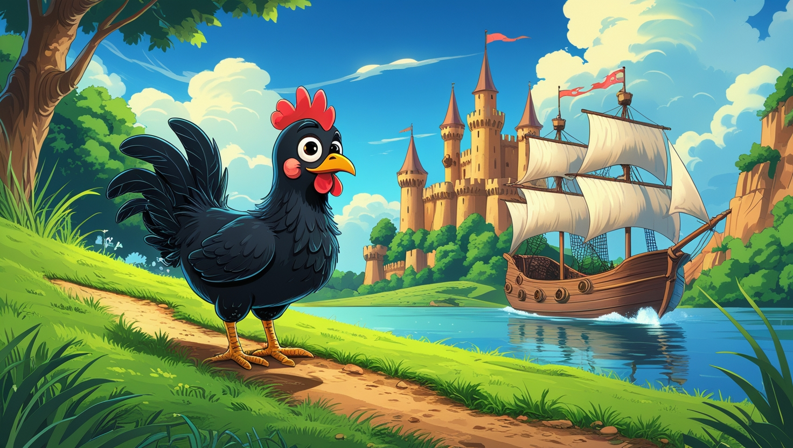

<div align="center">

  
# Run, Chicken, Run!

Run, Chicken, Run! est un jeu développé en Python dans le cadre de la Game Jam 2025 organisée par le BUT Informatique de l'IUT de Reims-Châlons-Charleville. Le jeu a été développé par l'équipe *Les Comtes de Monte-Bistrot*.

</div>
  
# 📖 • Sommaire

- [🚀 • Présentation](#--présentation)
- [🕯️ • L'histoire](#%EF%B8%8F--l-histoire)
- [📦 • Installation](#--installation)
- [▶️ • Lancement](#%EF%B8%8F--lancement)
- [⚙️ • Configuration](#%EF%B8%8--configuration)
- [🎮 • Règles du jeu](#--règles-du-jeu)
- [💻 • Développement](#--développement)
- [🎨 • Contributeurs](#--contributeurs)
- [📃 • Crédits](#--crédits)
- [📝 • License](#--license)

# 🚀 • Présentation

Ce dépôt contient le code source du jeu Run, Chicken, Run! développé en Python avec la librairie Pygame. Le jeu est un jeu dans lequel le joueur incarne une poule qui doit éviter les pirates et chevaliers pour survivre le plus longtemps possible.

# 🕯️ • L'histoire

Dans un royaume autrefois paisible, une prophétie étrange annonçait qu’une poule légendaire, surnommée Plumecœur, détiendrait un jour un pouvoir capable de renverser les forces des cieux et des mers. Ce pouvoir est enfermé dans un œuf d’or magique que seuls les plus courageux peuvent obtenir.  
  
Lorsque les chevaliers du royaume et les pirates des mers apprirent l’existence de cet œuf, ils jurèrent de le récupérer. Mais Plumecœur, une simple poule de ferme au courage inébranlable, le dévora accidentellement lors d’un banquet.  
  
Maintenant investie d’un fragment de pouvoir ancestral, Plumecœur doit fuir les chevaliers et les pirates enragés, tous déterminés à capturer la poule pour libérer l’œuf. Cependant, si elle attrape des grains d’énergie spéciale laissés par l’œuf, Plumecœur peut temporairement inverser la situation et devenir la prédatrice, semant le chaos parmi ses poursuivants.  

# 📦 • Installation

Pour installer le jeu, il suffit de cloner le dépôt Git :

```bash
git clone https://github.com/PaulBayfield/GameJam2025.git
```

Puis de se rendre dans le dossier du jeu :

```bash
cd GameJam2025
```

Enfin, il faut installer les dépendances du jeu :

```bash
python3 -m venv venv
source venv/bin/activate
pip install -r requirements.txt
```

# ▶️ • Lancement

Pour lancer le jeu, il suffit de lancer le script `__main__.py` :

```bash
python __main__.py
```

# ⚙️ • Configuration

Le jeu peut être configuré en modifiant les variables du fichier [`settings.py`](./settings.py). Vous pouvez notamment modifier la taille de la fenêtre ou encore les touches du jeu.  
  
Par défaut, les touches sont les suivantes :
- `↑` pour aller en haut
- `→` pour aller à droite
- `↓` pour aller en bas
- `←` pour aller à gauche
- `P` pour mettre le jeu en pause
- `ESPACE` pour dasher
- `ECHAP` pour quitter le jeu

De plus, vous pouvez également utiliser les touches ZQSD comme touches de déplacement. Vous pouvez aussi modifier la configuration si vous préférez utiliser les touches WASD.

# 🎮 • Règles du jeu

Le joueur incarne une poule qui doit éviter les pirates et chevaliers pour survivre le plus longtemps possible. La poule peut se déplacer de gauche à droite pour éviter les enemies. Le joueur peut également dash pour éviter les ennemis plus facilement.

# 💻 • Développement

Pour exécuter le linter Ruff juste avant chaque commit, il est nécessaire d'installer les hooks de pré-commit :

```bash
pre-commit install
```

# 🎨 • Contributeurs 

L'équipe de développement du jeu, nommée *Les Comtes de Monte-Bistrot*, est composée de 3 membres :

- [Lucas DEBEVE](https://github.com/LucasDebeve)
- [Justin PINGARD](https://github.com/JujuO814)
- [Paul BAYFIELD](https://github.com/PaulBayfield)

# 📃 • Crédits

Les assets utilisés dans le jeu proviennent de différentes sources, vous pouvez les retrouver dans le fichier [assets.txt](./assets.txt).

# 📝 • License

Run, Chicken, Run! est sous licence MIT. Vous pouvez consulter le fichier [LICENSE](./LICENSE) pour plus d'informations.
